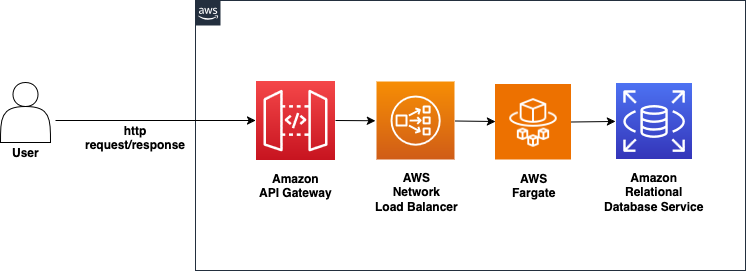

# Network Faults Demo Application on Amazon Elastic Container Service (ECS) Fargate with AWS Fault Injection Service (FIS)

This project demonstrates network fault action experiements using AWS FIS for an application running on [Amazon ECS with AWS Fargate](https://aws.amazon.com/about-aws/whats-new/2024/12/amazon-ecs-network-fault-injection-experiments-fargate/). The demo application is a three-tier application deployed on Amazon ECS with AWS Fargate, with API Gateway as the front end and RDS MySQL for data persistence.

## Repository Structure

The repository is organized into two main directories:

1. `app`: Contains the Node.js Express application code.
2. `cdk`: Contains the AWS CDK infrastructure code.


## Data Flow



The application follows a typical three-tier architecture:

1. Client -> API Gateway: The client sends HTTP requests to the API Gateway.
2. API Gateway -> Network Load Balancer: API Gateway routes requests to the internal Network Load Balancer.
3. Network Load Balancer -> ECS Fargate Tasks: The NLB distributes traffic across the Fargate tasks running the application.
4. ECS Fargate Tasks -> RDS MySQL: The application interacts with the RDS MySQL database for data persistence.

```
Client -> API Gateway -> NLB -> ECS Fargate Tasks -> RDS MySQL
```

The FIS experiments inject network faults at the ECS task level, affecting the communication between the Fargate tasks and the RDS database.

## Usage Instructions

### Prerequisites

- Node.js 18 or later
- AWS CLI configured with appropriate credentials
- Docker installed
- AWS CDK CLI installed (`npm install -g aws-cdk`)

### Installation

1. Clone the repository:
   ```
   git clone <repository-url>
   cd <repository-name>
   ```

2. Install dependencies for the CDK project:
   ```
   cd cdk
   npm ci
   ```

3. Bootstrap your AWS environment (if not already done):
   ```
   cdk bootstrap
   ```

4. Deploy the stacks:
   ```
   cdk deploy --all
   ```

This will deploy three stacks:
- `NetworkFaultsDemoStack`: Contains the main application infrastructure.
- `NetworkFaultsExperimentStack`: Contains the FIS experiment templates.
- `MonitoringStack`: Contains CloudWatch dashboard for monitoring the performance metrics.


### Load Generation
1. Install load generation dependencies
   ```
   cd ../load-gen
   npm install -g artillery@latest
   npm ci
   ```
2. Get the API end point from the `NetworkFaultsDemoStack` stack output after deployment.
Set this as an environment variable.
```
export API_URL='<end point from the installtion output>'
```
3. Run the load test
```
artillery run load-gen-config.yaml
```

### Running FIS Experiments

Run the FIS experiments from the AWS Console or using the AWS CLI. The experiment templates are:

   1. Network Latency Experiment
   2. Network Packet Loss Experiment
   3. Network Port Blackhole Experiment

## Monitoring and Observability
The application includes monitoring through CloudWatch dashboards that track both API Gateway metrics and Artillery load test results.

The dashboard "FIS-Network-Experiments-Dashboard" includes the following widgets:

#### Operator Perspective
##### API Gateway Performance

| Metric | Description | Statistic |
|--------|-------------|-----------|
| Integration Latency | Time between API Gateway's backend request and response | Average |
| Overall Latency | Total time between client request and response | Average |

##### API Gateway Errors

| Error Type | Description | Statistic |
|------------|-------------|-----------|
| 5XX Errors | Server-side errors (500-599) | Sum |
| 4XX Errors | Client-side errors (400-499) | Sum |
| Integration Errors | Backend integration failures | Sum |


#### End User Perspective
##### Latency

| Metric | Description | Statistic |
|--------|-------------|-----------|
| Minimum Response Time | Fastest request completion time | Minimum |
| Maximum Response Time | Slowest request completion time | Maximum |
| P99 Response Time | 99th percentile response time | Percentile |
| Median Response Time | 50th percentile response time | Median |

##### Error Tracking

| Error Type | Description | Statistic |
|------------|-------------|-----------|
| HTTP 400 | Client-side validation failures | Sum |
| HTTP 500 | Server-side internal errors | Sum |
| HTTP 502 | Gateway timeout errors | Sum |
| ETIMEDOUT | Network connection timeouts | Sum |


### Cleanup
Delete the stacks created:
```
cdk destroy --all
```